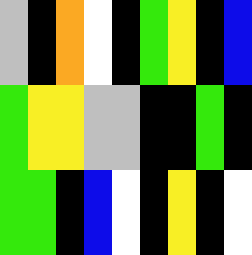

# Система цветовой визуализации текста

## Disclaimer

Это одна из первых попыток переноса кода обучения модели в формат скрипта, поэтому при возникновении ошибок, пожалуйста, воспользуйтесь нашим [colab-ноутбуком](https://colab.research.google.com/drive/15POGKbrMo2Qv4BsmTElE4aOL98tOSP6Z?usp=sharing)!

## Overview

Данный репозиторий содержит код обучения и разработки сервиса для выделения цветов в тексте и составления цветовой визуализации.

## Relevance of service

 > Цветовая символика – очень актуальный предмет исследования в наши дни. Проблема цветовой символики является проблемой общегуманитарного плана, она интересует психологов, богословов, философов, литературоведов. В последнее
время поощряются междисциплинарные подходы, позволяющие интегрировать знания различных гуманитарных наук. Проблема цветовой символики
как раз относится к числу междисциплинарных. [[1](http://www.vestnik.vsu.ru/pdf/phylolog/2012/02/2012-02-06.pdf)]

Данный сервис призван значительно упростить работу исследователей-филологов по составлению цветовых характеристик цвета в литературе. 
На данный момент практически вся разметка текста для дальнейших исследований проводится неавтоматизированным, ручным способом.

## Dataset

Датасет, на котором обучалась и валидировалась модель, был составлен и размечен вручную. Для датасета были подобраны тексты на русском языке, в которых
встречаются цвета в форме разных частей речи (прилагательные - например, синий; существительные - например, синева; глаголы - например, синеет). 
Тексты представлены в виде разных форматов - классическая проза, стихи, фрагменты из статей из интернета. 
Цвета представлены в виде разных оттенков (например, для фиолетового - пурпурный, фиолетовый, лавандовый  и пр.)

Разметка датасетов (обучающего и валидационного) проводилась с помощью сервиса [NER Text Annotator](https://tecoholic.github.io/ner-annotator/). 
Результат разметки являет собой файл с данными в json-формате, соответствующему формату SpaCy. 

В тренировочном датасете 55 текстов разного объема, каждый цвет представлен в датасете не менее чем 15 раз. 
Валидационный датасет содержит 5 текстов разного объема, в котором встречаются все выбранные цвета.

## Project structure

Проект имеет следующую структуру:
* model - папка со скриптами
  * best-model - сохраненная обученная модель
  * utils - папка со служебными скриптами
	* prepare_data.py - перевод датасетов в формат spacy
	* visualisator.py - функции для формирования изображения 
  * config.cfg - конфигурационный файл
  * trainer.py - скрипт обучения
  * pipeline.py - скрипт для использования модели
* requirements.txt - необходимые зависимости
* annotations_train.json - файл с тренировочным датасетом
* annotations_val.json - файл с валидационным датасетом

Файл с датасетом можно взять [здесь](https://drive.google.com/drive/folders/1TAEWzlwLmns7JWXD7huAVZrqKkL2yOOI?usp=sharing).

## Training

Данная задача является задачей распознавания именнованных сущностей (Named Entities Recognition - NER). 
В нашем случае именнованными сущностями являются цвета.
При обучении модели использовалась библиотека [spaCy](https://spacy.io/).
В качестве исходной использовалась модель `sentence-transformers/msmarco-distilbert-base-tas-b`. 
Для запуска обучения модели следует запустить скрипт 
```
cd model
python trainer.py
```

## Результаты

Разработанная система умеет определять оттенки 11 цветов: белый, черный, красный, оранжевый, зеленый, 
желтый, голубой, синий, фиолетовый, коричневый, серый.

Ниже приведены примеры работы системы:
<figure>
    
    <figcaption>Зимнее утро, А.С. Пушкин</figcaption>
</figure>
</br>
</br>
<figure>
    
    <figcaption>Черный человек, С.А. Есенин</figcaption>
</figure>
</br>
</br>
<figure>
    
    <figcaption>Первая глава романа "Мастер и Маргарита", М.А.Булгаков </figcaption>
</figure>
</br>
</br>

Для проверки работы системы запустите скрипт 
```
cd model
python pipeline.py имя_файла_с_текстом 
```
Например: `python pipeline.py pushkin.txt`

## Эксперименты

Было проведено несколько экспериментов с разными параметрами, результаты представлены в таблице ниже:


|Architecture   |Размер пакета (batch size)   |Частота проведения оценки (evaluation steps)   |Количество эпох (epochs)   |Loss NER |ENTS_F |ENTS_P | ENTS_R | SCORE |
|---|---|---|---|---|---|---|---|---|
|TransformerModel (bert-base-multilingual-uncased)   |256   |200   |300   |20834.92 |96.83 |96.61 | 97.05| 0.97|
| |   |   |600   |1734.27| 97.16| 97.27| 97.05| 0.97|
| |128   |   |300   |20643.19| 97.05| 96.83| 97.27| 0.97|
|  |   |   |600   |1702.68| 97.17| 96.84| 97.50| 0.97|
|  |   |   |700   |267.91| 97.17| 96.84| 97.50| 0.97|
|  |64   |   |300   |20609.69| 97.03| 97.70| 96.36| 0.97|
|  |   |   |566   |2829.49| 96.83| 96.61| 97.05| 0.97|
|  |128   |100   |533   |2037.57| 97.51| 97.29| 97.73| 0.98|
|  |   |   |700   |121.70 | 96.93| 97.04| 96.82| 0.97|
|Tok2Vec   |1000   |200   |340   |8.54| 94.04| 96.87| 91.36| 0.94|
|   |256   |   |196   |67.31| 94.79| 96.69| 92.95| 0.95|
|   |   |100   |200   |115.20| 94.04| 96.87| 91.36| 0.94|
|   |   |   |473   |0.00| 94.85| 97.83| 92.05| 0.95|


Как видно, лучшие значения метрик достригаются при следующих параметрах:
* TransformerModel (bert-base-multilingual-uncased)
* 533 эпохи
* Размер батча - 128
* Частота оценки качества - 100 шагов

Лучшую модель с конфигурационным файлом можно найти [здесь](https://drive.google.com/drive/folders/1-kjF7SWZbKIR5Mp_IOoQbxOnO17FQ8C5?usp=sharing).
